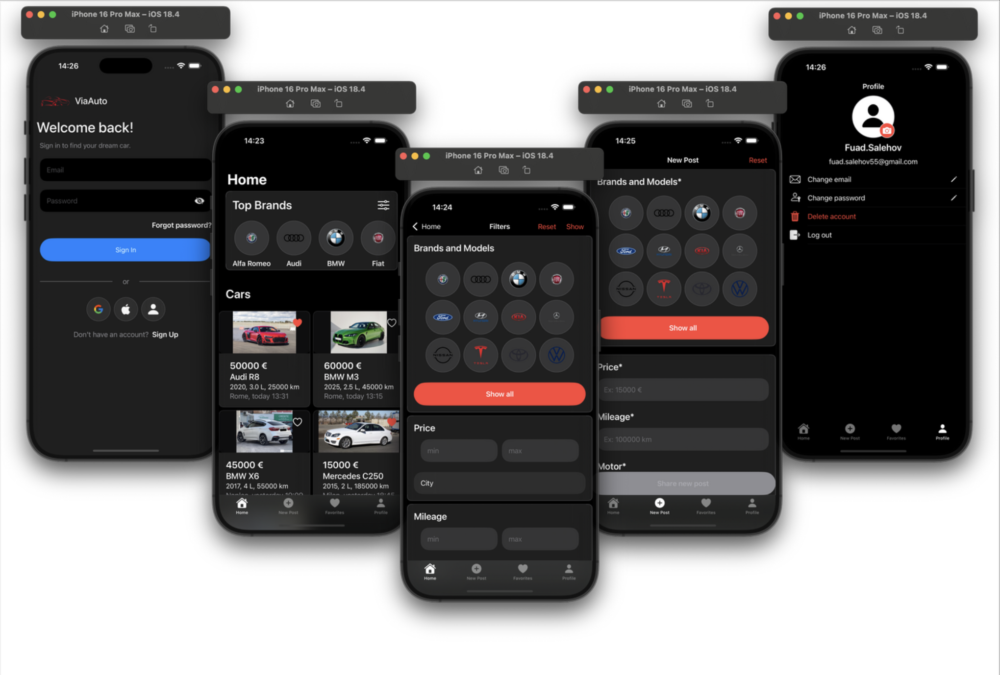

# 🚗 ViaAuto – iOS Car Marketplace App

ViaAuto is a modern, SwiftUI-based iOS application that allows users to **buy, sell, and favorite cars**. The app integrates with **Firebase** for user authentication, image storage, and real-time Firestore database support.

---

## 📱 Features

- ✅ User authentication (Email/Password, Google Sign-In, Anonymous)
- ✅ Create and upload new car posts with photos
- ✅ Brand & model picker with support from a JSON dataset
- ✅ City selector (using Italian cities)
- ✅ Favorite/unfavorite cars
- ✅ View favorite cars on a dedicated screen
- ✅ Car detail view with full-screen image viewer
- ✅ Upload and update user profile photo
- ✅ Edit email and password
- ✅ Link anonymous accounts to Google or Email
- ✅ Support for modern UI components like:
  - `TabView` with image carousel
  - `AsyncImage`
  - `PhotosPicker`
  - Custom forms and validation

---

## 🔧 Tech Stack

- **SwiftUI**
- **Firebase Authentication**
- **Firebase Firestore**
- **Firebase Storage**
- **Google Sign-In**
- **MVVM Architecture**
- **Swift Concurrency (async/await)**

---

 ## 📸 Screenshot

### 🚘 ViaAuto App Overview

